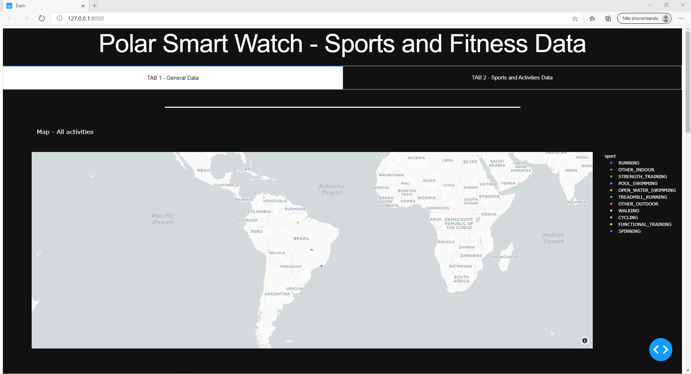

# hackathonIESB

Project developted for the 2020 IESB Hackathon - Specialization Course in AI 

YouTube link to the hackathon's presentations: https://www.youtube.com/watch?v=kCfS11cdaj0 / IESB Specialization course in AI - https://www.iesb.br/pos/curso/inteligencia-artificial-remoto-

This repository consists of the python script that creates a  Plotly/Dash dashboard of a Polar smartwatch Dataset, provided by Mateus Mendelson (https://github.com/mendelson, https://github.com/mendelson/polar-sample-database).

Just put the script and all of the json files in the same folder and run it in your terminal. It should generate the dashboard running in your local sever and a link access it through your web browser.

1 - Original version developed for the hackathon: File -> polar_data_DavidRocha.py

2 - Improved version developed after the hackathon: File -> Dash_polar_tab.py

